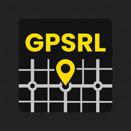

# GPS ReLocator

<p align="center">
  
</p>

<p align="center">
  <strong>Android-приложение для принудительной смены GPS-геолокации</strong><br/>
  Заставляет телефон "думать", что он находится в любом месте на карте
</p>

<p align="center">
  
  
  
  
</p>

---

## Скриншоты

> Тёмная тема, жёлтые акценты, 3 вкладки

| Карта | Сохранённые места | Настройки |
|-------|-------------------|-----------|
| Перемещай карту — прицел фиксирован | Список мест одним тапом | Интервал, точность, тип карты |

---

## Функциональность

### Вкладка 1 — Карта
- Полноэкранная карта (OSMDroid + CartoDB Dark Matter) без API ключей
- Фиксированный прицел в центре — карта двигается под ним
- Кнопка **«Релоцировать»** — запускает подмену GPS на выбранные координаты
- Кнопка **«Отменить»** — возвращает реальную геолокацию
- Кнопка **★** — сохранить текущее место в список
- FAB «моё местоположение» — центрировать на реальной позиции
- Статус-индикатор (активна/не активна смена)

### Вкладка 2 — Сохранённые места
- Список сохранённых локаций (Room Database)
- Кнопка **«Перейти»** — открывает карту и центрирует на этом месте
- Кнопка удаления с подтверждением

### Вкладка 3 — Настройки
- Интервал обновления мок-локации (250мс — 30с)
- Точность GPS-сигнала (0.5м — 50м)
- Держать экран активным во время релокации
- Тип карты: тёмная / стандарт / спутник
- Компас на карте
- Инструкция по настройке
- Версия сборки, автор

---

## Принцип работы

Приложение использует **Android Mock Location API**:

```
LocationManager.addTestProvider()  →  регистрирует виртуальный GPS-провайдер
LocationManager.setTestProviderLocation()  →  непрерывно публикует выбранные координаты
```

Подмена транслируется **всем приложениям** на устройстве через системный `LocationManager`.  
Работает в фоне через **ForegroundService** — с уведомлением в шторке.

---

## Требования

- Android **8.0+** (API 26+)
- Режим разработчика включён
- Приложение назначено как **Mock Location App**

---

## Быстрый старт

### 1. Клонировать и собрать

```bash
git clone https://github.com/pronink/GPS-ReLocator.git
cd GPS-ReLocator
./gradlew assembleDebug
```

> API ключ не нужен — карты работают через OpenStreetMap / CartoDB.

### 2. Установить на устройство

```bash
adb install app/build/outputs/apk/debug/app-debug.apk
```

### 3. Настроить Mock Location на телефоне

1. **Включить режим разработчика:**  
   Настройки → О телефоне → Сведения о ПО → нажать **«Номер сборки» 7 раз**

2. **Назначить приложение:**  
   Настройки → Параметры разработчика → **«Выбрать приложение для имитации местоположения»** → GPS ReLocator

3. Открыть приложение, переместить карту в нужное место, нажать **«Релоцировать»** ✓

---

## Стек технологий

| Компонент | Библиотека |
|-----------|-----------|
| Язык | Kotlin 1.9 |
| Карты | [OSMDroid 6.1.20](https://github.com/osmdroid/osmdroid) |
| База данных | Room 2.6 |
| Навигация | Navigation Component 2.7 |
| UI | Material Components 1.11 |
| Локация | FusedLocationProvider |
| Фон | ForegroundService + Coroutines |
| Архитектура | MVVM (ViewModel + LiveData) |

---

## Структура проекта

```
app/src/main/java/com/pronin/gpsrelocator/
├── MainActivity.kt
├── data/
│   ├── SavedPlace.kt          # Room entity
│   ├── SavedPlaceDao.kt
│   └── AppDatabase.kt
├── service/
│   └── MockLocationService.kt # ForegroundService — ядро подмены GPS
├── ui/
│   ├── map/
│   │   ├── MapFragment.kt     # OSMDroid + управление релокацией
│   │   └── MapViewModel.kt
│   ├── saved/
│   │   ├── SavedPlacesFragment.kt
│   │   ├── SavedPlacesViewModel.kt
│   │   └── SavedPlacesAdapter.kt
│   └── settings/
│       └── SettingsFragment.kt
└── utils/
    ├── PrefsManager.kt
    └── Extensions.kt          # isMockLocationEnabled()
```

---

## Важно

> Приложение создано в образовательных целях.  
> Использование подмены геолокации может нарушать условия использования некоторых сервисов.  
> Автор не несёт ответственности за последствия применения.

---

## Автор

**Пронин К.Н.**  
GPS ReLocator v1.0.0
